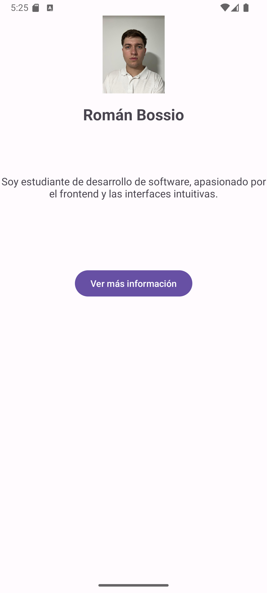
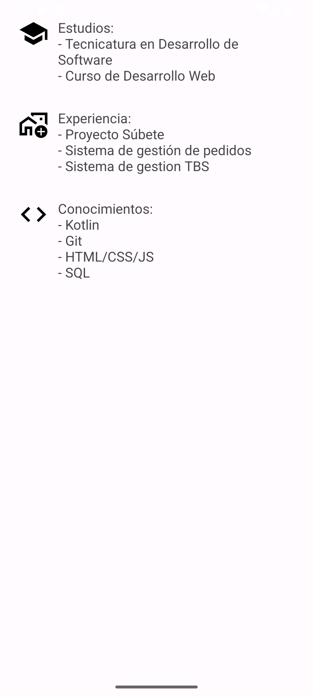

# CurriculumApp

Aplicación Android desarrollada como proyecto académico. Muestra un currículum personal en dos pantallas:

### 🖼️ MainActivity
- Foto de perfil 
- Nombre y breve descripción
- Botón para ver más información

### 📄 SecondActivity
- Estudios, experiencia y conocimientos
- Íconos vectoriales representativos

### 🚀 Tecnologías usadas
- Kotlin
- ConstraintLayout
- Vector Assets
- ScrollView
- Intents

### 📷 Captura de pantalla

### 📷 Capturas de pantalla

**Pantalla principal:**

**Pantalla secundaria:**

